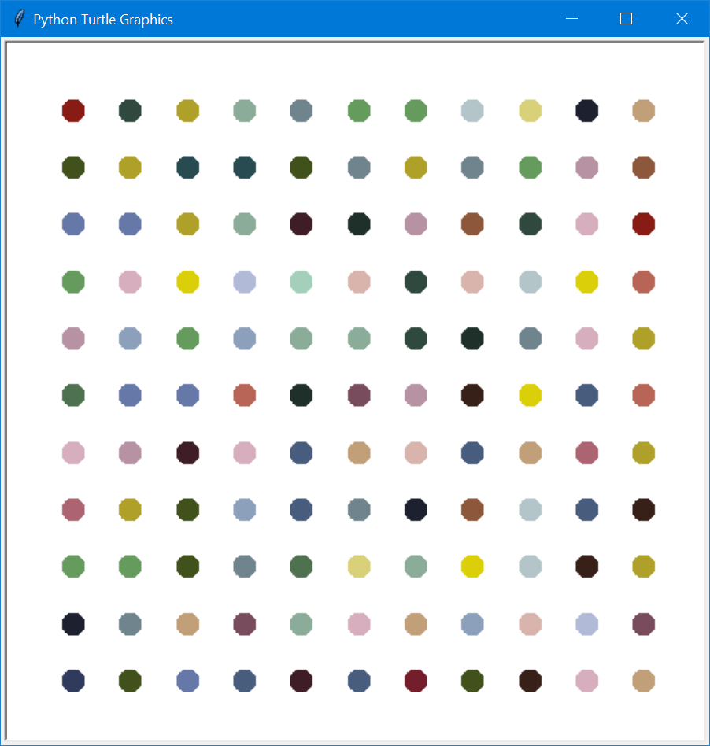

<H1>Hirst Painting</H1>

<H2>Turtle Graphics in Python</H2>
I used code to filter out shades of light and dark colours from the extracted colours prior to pasting the RGB list.

I get inputs from the user for dot size, spacing, number of dots in x and y axis. Then I size the screen appropriately to correctly centre the grid.

I used absolute positioning of the turtle, to paint the dots on the x-y grid in only 4 lines of code, and then hide the turtle.

Anybody want to bid for my painting? Going cheap starting at only £1M...

